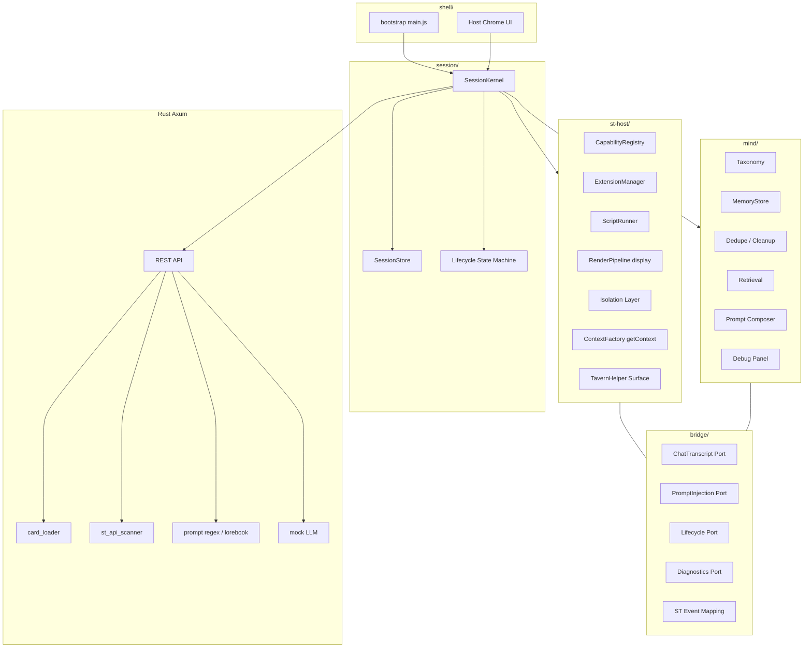
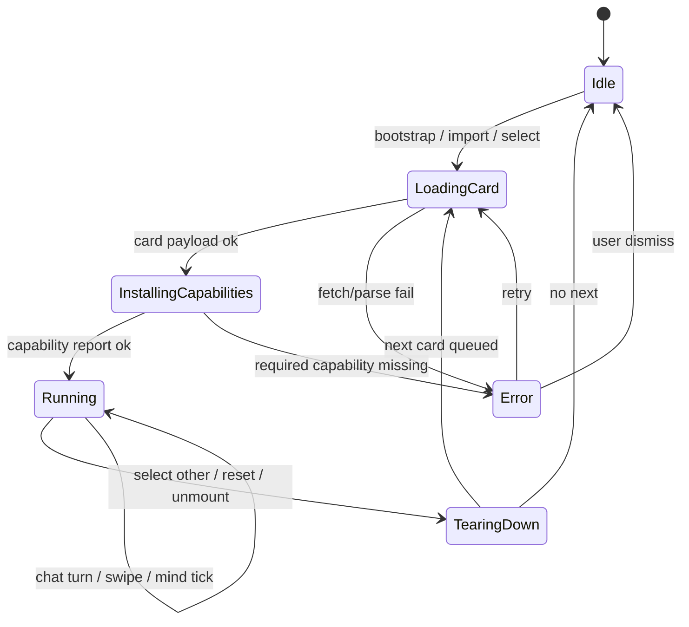
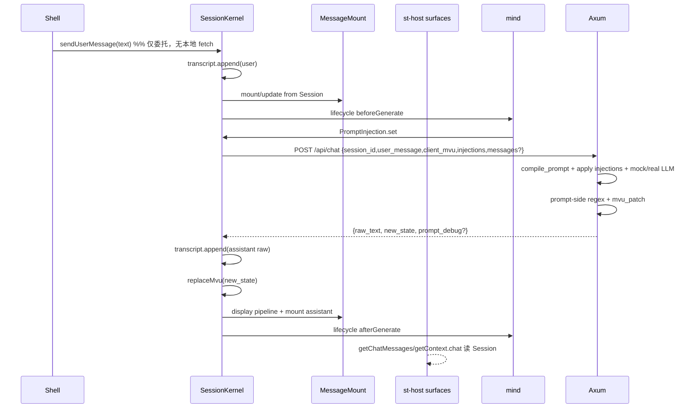
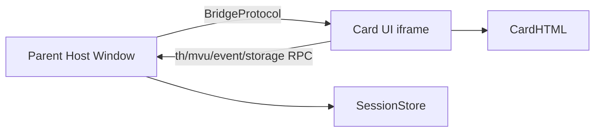
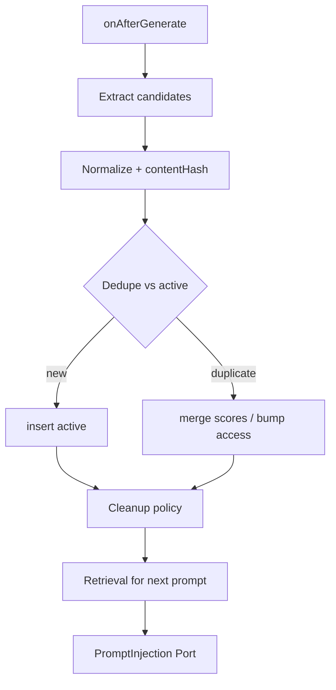

# Conclave：ST 兼容宿主 + NPC Mind/Memory Harness 重设计

| 字段 | 值 |
|------|-----|
| **文档** | Architecture Design — ST Host & Mind Harness |
| **作者** | Conclave Architecture（设计稿） |
| **P0 DRI** | 开工时在 PR-01a 指定单一负责人；未指定前不得并行改 `main.js` 与后端初始状态 |
| **日期** | 2026-08-01 |
| **修订** | 2026-08-01 r3 — 记录 PR-01a～PR-06 落地状态（见 §PR Plan / Implementation Log） |
| **状态** | In progress — P0 主体已落地；P1 中（PR-06 完成，PR-07 chat 同步待做） |
| **项目路径** | `/Users/makima/program/Conclave` |
| **ST 参考源码** | `/Users/makima/program/SillyTavern-release` |
| **取代方向** | `docs/st-api-compat-plan.md` / `docs/st-api-compat-log.md`（历史补丁日志保留；架构方向以本文为准） |

---

## Overview

Conclave 当前是一个面向 SillyTavern 角色卡的宿主：Rust Axum 后端负责卡片加载、mock LLM、prompt 组装与显示正则近似渲染；前端 `frontend/src/main.js`（约 1621 行）在同一 window 注入 ST/TavernHelper 兼容运行时，执行卡片 HTML/脚本。该形态以补丁堆叠演进，出现六类结构性缺陷：**无会话内核、无能力契约、隔离仅靠事后清理、双真相源（`game_state` vs `runtimeState`）、静默 stub、卡片硬编码（苍玄界默认），以及 `runtime_requirements` 扫描结果不驱动安装**。

本文提出一次性架构重设计，达成两个产品目标：

1. **G1 — ST 兼容前端宿主**：可安装第三方插件表面、可运行卡片脚本（JS-Slash-Runner / TavernHelper 模型）、完整兼容显示/prompt 正则语义（placement / markdownOnly / promptOnly / depth）。
2. **G2 — NPC Mind/Memory 产品层**：NPC 心智分类维度 + 历史记忆去重清理；默认静默 prompt 增强 + 可见调试面板；**不是**角色卡 HTML 补丁。

集成原则固定为：

```
Shell → Session Kernel（单一真相） → G1 ST Host || G2 Mind/Memory
集成仅经 Ports：ChatTranscript | PromptInjection | Lifecycle | Diagnostics
st-host 不得 import mind；mind 不得 import 具体 ST API 实现
```

---

## Background & Motivation

### 当前架构快照

| 层 | 关键路径 | 职责 |
|----|----------|------|
| 后端状态 | `backend/src/main.rs` `AppState` | `game_state: Arc<RwLock<Value>>` + `CardStore` |
| 卡片解析 | `backend/src/card_loader.rs` | V3 卡、`regex_scripts`、`tavern_helper.scripts`、世界书 |
| 显示正则 | `backend/src/pipeline/regex_engine.rs` + `render_card_message` | 两阶段 DisplaySource + MarkdownDisplay；**忽略 placement / min_depth / max_depth / run_on_edit**；`expand_replacement` 处理 `$n` 但与 JS 端口需 golden 对齐；**另有** `append_card_status_placeholder_if_needed` 预注入 `<StatusPlaceHolderImpl/>` |
| 依赖扫描 | `backend/src/st_api_scanner.rs` | `scan_card` → `StRuntimeRequirements`；**前端仅存储不安装** |
| Prompt | `backend/src/lorebook/mod.rs` `compile_prompt` | 硬编码读取 `stat_data.世界系统.大区域` |
| 前端宿主 | `frontend/src/main.js` | DOM shell + `createRuntime` + 脚本执行 + 清理 |
| 初始状态 | `initial_game_state` / `createRuntime.defaultMvuData` | **苍玄界字段写死** |

API 面（现状）：

- `GET /api/init`
- `POST /api/import-card` / `POST /api/select-card`
- `GET /api/greetings` / `GET /api/runtime-requirements`
- `POST /api/chat`（mock LLM + MVU patch + 后端显示正则）

### 痛点（与代码锚点）

1. **无 Session Kernel**  
   `appState`（前端全局）与 `AppState.game_state`（后端）各自持有会话片段；切换卡片靠 `cleanupCardArtifacts` + 重建 `createRuntime`，无显式生命周期状态机。

2. **无 Capability Contract**  
   `createRuntime` 用 `Object.assign(window, …)` 一次性铺全局；`runtime_requirements` 写入 `appState.runtimeRequirements` 后无消费者（`applyInitData` 仅赋值）。

3. **隔离脆弱**  
   已有 scoped `localStorage`/`indexedDB` 与 artifact observer（`cleanupCardArtifacts`），但仍是 same-window 执行卡片 `<script>` 与 TavernHelper `import()` blob；无法防全局污染与 CSS 外溢。P2 必须切到强制 iframe。

4. **三重漂移（比「双真相」更严重）**  
   今日 chat 路径存在 **三路独立真相**，且互不同步：  
   1. **DOM**：`sendUserMessage` 只调用 `appendUserMessage` / `appendAssistantMessage` 画 HTML；  
   2. **前端 runtime**：`runtimeState.messages` / `mvuData` **不**因 chat 追加 user/assistant 轮次（开场后 `getChatMessages` 仍像只有 opening）；  
   3. **后端 `game_state`**：`mvu_patch` 更新后经 `new_state` 返回，但前端 **丢弃**。  
   结果：可见对话、TH API、服务端状态可各自正确却彼此矛盾。设计目标是收束为 **SessionStore 单一真相**（§3.3、PR-07）。

5. **静默 stub**  
   - `SillyTavern.getContext() { return TavernHelper; }` — **明确禁止**（与真实 ST `public/scripts/st-context.js` 语义冲突）  
   - `triggerSlash` 仅 `console.log` 后返回 `''`  
   - `formatAsTavernRegexedString` 恒等透传  
   - `Mvu.parseMessage` 原样返回 `oldData`

6. **卡片硬编码**  
   `defaultMvuData`（主角状态/灵石/修为）、`defaultProfileContent`（苍玄界档案）、lorebook 别名 `'苍玄界_修订版世界书'` 等写在内核路径。

7. **历史文档方向**  
   `docs/st-api-compat-plan.md` 记录了从 iframe shim → 同窗 ST Host 的补丁路径；本文**取代该方向**，回到“模块边界按 iframe 设计 + 会话内核 + 能力注册表”。

### SillyTavern 事实锚点（设计必须以源码为准）

| 主题 | ST 源码 | 对 Conclave 的含义 |
|------|---------|-------------------|
| `getContext()` | `public/scripts/st-context.js` | 返回宿主真实对象（chat、eventSource、setExtensionPrompt、slash 等），**不是** TavernHelper |
| 显示/Prompt 正则 | `public/scripts/extensions/regex/engine.js` `getRegexedString` | `markdownOnly`/`promptOnly`/`placement`/`minDepth`/`maxDepth`/`runOnEdit` |
| placement 枚举 | 同文件 `regex_placement` | `USER_INPUT=1`, `AI_OUTPUT=2`, `SLASH_COMMAND=3`, `WORLD_INFO=5`, `REASONING=6` |
| 扩展安装 | `public/scripts/extensions.js` + `src/endpoints/extensions.js` | manifest 发现、install、activate；disable 常需 reload |
| 扩展 prompt 注入 | `script.js` `setExtensionPrompt` | Mind 的默认注入应对齐此语义（经 Port，不直接耦合 ST API） |
| 卡片脚本 | JS-Slash-Runner / TH 实践 | **iframe + predefine bridge**，非主窗直接 import 卡片 UI 脚本 |

---

## Goals & Non-Goals

### Goals

| ID | 目标 | 验收要点 |
|----|------|----------|
| G1.1 | Session Kernel 为唯一会话真相 | 切换卡/重置会话走状态机；前后端经明确同步协议，禁止 silent dual write |
| G1.2 | Capability Registry 驱动安装 | `scan_card` 结果 → 能力矩阵 → 安装/拒绝/stub-with-banner |
| G1.3 | 前端成为 display regex 权威（自 P1） | AI 输出展示路径走前端 `RenderPipeline`；后端可保留 prompt-side 与可测纯函数 |
| G1.4 | TavernHelper / 脚本生命周期可清理 | 切换卡可 `teardown`；P2 iframe 强制隔离卡片 UI |
| G1.5 | 最小真实 `getContext()` | 字段与 ST 对齐的子集；**永不** `getContext === TavernHelper` |
| G2.1 | Mind 产品层 | taxonomy + memory store + dedupe/cleanup + retrieval |
| G2.2 | 默认静默 prompt 注入 | 经 `PromptInjection` Port；不自动写回 MVU/lorebook/chat |
| G2.3 | 可见 Debug Panel | 记忆条数、标签、上次清理时间 |
| G2.4 | Feature flag | Mind 可关；G1 独立可用 |
| G2.5 | 验证路径 | **先 mock LLM 证明注入**，再接真实 LLM |

### Non-Goals（本设计周期）

- 完整复刻 SillyTavern 全部扩展生态（任意第三方扩展 → **P4**）
- 完整 MVU 语义引擎 / 完整 slash command 解释器（仅最小可运行子集 + 显式能力声明）
- 多用户 / 账号系统 / 云同步
- 自动将 Mind 记忆写回角色卡或世界书
- 多会话并行 UI 完整产品化（数据模型预留；交互 **P4**）
- 与 ST 后端扩展 git install 协议 100% 兼容（P2 先本地/manifest 面）

---

## Key Decisions

以下六项为用户拍板的 **FINAL** 决策，实现不得重新打开争论。

| # | 决策 | 实现约束 |
|---|------|----------|
| KD1 | **隔离**：P0/P1 same-window + 强清理 + storage 命名空间；**P2 强制 iframe 承载卡片 UI** + bridge | 模块边界 **Day-1 按 iframe 可拆分设计**（接口不依赖 `window` 单例） |
| KD2 | **扩展范围**：P2 先交付 JS-Slash-Runner/TavernHelper 表面 + **最小真实 `getContext()`**；任意第三方扩展 **P4** | **禁止** `getContext() === TavernHelper` |
| KD3 | **Display regex 权威**：自 P1 起 **前端为 display 源真相**；Rust 聚焦 prompt-side 与纯函数；长期避免双实现漂移 | 后端 `RegexPipeline::process` 退出展示主路径；可改为 `prompt_only` 或 shared 算法 crate 可选 |
| KD4 | **G2 产品形态**：默认 **静默 prompt 增强** + **可见 debug panel**；数据模型 multi-NPC-ready；MVP 单主 NPC | UI 不强迫用户操作记忆即可生效 |
| KD5 | **Memory 权威**：Mind **默认只注入 prompt**；**永不**自动写回卡 MVU/lorebook/chat；写回仅显式用户动作（未来） | `MemoryWriteBackPort` 默认 no-op / 未注册 |
| KD6 | **G2 验证**：mock LLM 先证明注入路径；Mind feature-flag；G1 可关 Mind 独立工作 | 唯一开关名 **`conclave:feature:mind`**（localStorage `'1'`）+ 查询别名 `?mind=1`；默认 off 直至 P3 验收。**禁止**再引入 `features.mind.enabled` 第三名称 |

附加工程禁令（硬约束）：

- **禁止** 在 `main.js` 继续堆 per-card 补丁  
- **禁止** 静默 stub 伪装成已实现 API（stub 必须 `CapabilityStatus = 'stub' | 'missing'` 且 Diagnostics 可见）  
- **禁止** 宿主内核苍玄界硬编码默认  
- 探索代码优先 CodeGraph（见 `AGENTS.md`）；ST 语义以 SillyTavern 源码为准

---

## Proposed Design

### 1. 总体架构



**依赖规则（eslint/import 边界，P0 强制 — 见 PR-01a / PR-05）：**

```
shell → session, st-host, mind, bridge
session → bridge (ports only)
st-host → bridge, shared
mind → bridge, shared
st-host ↛ mind
mind ↛ st-host
bridge ↛ st-host / mind 实现细节
shared ↛ shell / session / st-host / mind
```

**ESLint 禁止模式（`eslint-plugin-import` `no-restricted-paths`，PR-01a 落地）：**

| From globs | Forbidden import globs |
|------------|------------------------|
| `src/st-host/**` | `src/mind/**` |
| `src/mind/**` | `src/st-host/**` |
| `src/mind/**` | `src/st-host/context/**`, `src/shell/**`（mind 只能 ports） |
| `src/bridge/**` | `src/st-host/**`, `src/mind/**`, `src/shell/**` |
| `src/shared/**` | `src/shell/**`, `src/session/**`, `src/st-host/**`, `src/mind/**` |

CI：`npm run lint` 为每个 FE PR 必跑门禁（与 `npm test` / `npm run build` / `cargo test` 并列，见 PR Plan 总则）。

### 2. 目标目录布局

```
frontend/src/
  main.js                 # P0 末（PR-04/05 后）目标 <150 行 bootstrap；PR-01a 仍可 orchestrate
  shell/
    HostShell.js          # 左右栏、导入、发送区、#st-diagnostics-strip
    styles/               # 从 App.css 迁出宿主样式
  session/
    SessionKernel.js      # 状态机 + 编排
    SessionStore.js       # 单一真相存储
    types.js              # SessionSnapshot 等
  st-host/
    capabilities/
      CapabilityRegistry.js
      CapabilityCatalog.js  # 已知能力清单与实现绑定
      installFromRequirements.js
    context/
      ContextFactory.js     # 最小真实 getContext()
      TavernHelperSurface.js
      MvuSurface.js
      EventBus.js
    render/
      RenderPipeline.js     # display regex 权威
      RegexEngine.js        # 对齐 getRegexedString 语义
      HtmlFence.js
      MessageMount.js
    scripts/
      ScriptRunner.js       # TH + card scripts
      StorageNamespace.js   # 既有 scoped storage 迁入
    isolation/
      ArtifactTracker.js    # P0/P1 cleanup
      GlobalAdapter.js      # P0：install 目标抽象（WindowAdapter | 未来 IframeAdapter）
      CardFrame.js          # P2 iframe
      BridgeProtocol.js     # postMessage schema + method allowlist
    extensions/
      ExtensionManager.js   # P2
  mind/
    MindService.js
    taxonomy.js
    MemoryStore.js
    dedupe.js
    cleanup.js
    retrieval.js
    promptCompose.js
    MindDebugPanel.js
    flags.js
  bridge/
    ports.js                # 接口定义
    createPorts.js          # Session 装配
    stEventMap.js           # ST event 名映射
  shared/
    clone.js
    id.js
    assert.js
```

后端增量（不推翻现有模块名，只收紧职责）：

```
backend/src/
  main.rs                 # 路由变薄；去掉 display 权威职责
  card_loader.rs          # 保持
  st_api_scanner.rs       # 输出接入 capability 协议（字段可扩展）
  pipeline/
    regex_engine.rs       # 仅 prompt-side / 共享纯函数 / 测试
    mvu_patch.rs          # 保留；与 Session 同步协议对齐
  lorebook/               # compile_prompt 去卡片硬编码路径
  mind/                   # P3：可选服务端记忆持久化（MVP 可纯前端）
    mod.rs
```

### 3. Session Kernel 与生命周期状态机

#### 3.1 Session 单一真相

`SessionStore` 持有完整 `SessionSnapshot`；前端 UI、ST Host、Mind、后端同步均以它为准。

```typescript
// frontend/src/session/types.js （JSDoc / 未来 TS）

/** @typedef {'idle'|'loading_card'|'installing_capabilities'|'running'|'tearing_down'|'error'} SessionPhase */

/**
 * @typedef {Object} SessionSnapshot
 * @property {string} sessionId
 * @property {SessionPhase} phase
 * @property {CardRef|null} card
 * @property {ChatMessage[]} messages
 * @property {MvuBundle} mvu              // 与消息 swipe 对齐的权威副本
 * @property {VariableBuckets} variables  // chat/character/global/preset/script/extension
 * @property {Record<string, LorebookEntry[]>} lorebooks
 * @property {StRuntimeRequirements|null} requirements
 * @property {CapabilityInstallReport|null} capabilities
 * @property {MindSnapshot|null} mind     // Mind off 时为 null
 * @property {SessionFlags} flags
 * @property {string|null} lastError
 */

/**
 * @typedef {Object} CardRef
 * @property {number} importId
 * @property {string} name
 * @property {RegexScript[]} regexScripts
 * @property {TavernHelperScript[]} tavernHelperScripts
 * @property {WorldbookEntry[]} worldbookEntries
 * @property {string[]} openingRaw
 * @property {string[]} openingRenderedHint  // 后端可选预渲染；display 以前端为准
 */

/**
 * @typedef {Object} ChatMessage
 * @property {number} message_id
 * @property {'user'|'assistant'|'system'} role
 * @property {string} name
 * @property {boolean} is_hidden
 * @property {string} message
 * @property {object} data
 * @property {object} extra
 * @property {number} swipe_id
 * @property {string[]} swipes
 * @property {string[]} rendered_swipes   // display 管道产物（前端写）
 * @property {object[]} swipes_data
 * @property {object[]} swipes_info
 */
```

#### 3.2 状态机



**转移不变量：**

| 转移 | 必须动作 |
|------|----------|
| → `TearingDown` | 取消 pending timers；`ScriptRunner.abort`；artifact/iframe destroy；卸除本会话 globals（via registry）；Mind `onSessionEnd` |
| → `InstallingCapabilities` | 基于 `requirements` 安装；**未声明为实现的 API 不得静默成功** |
| → `Running` | 发布 `Lifecycle.sessionReady`；执行 TH scripts；挂载 opening message display |
| 任意 → `Error` | `lastError` + Diagnostics banner；不留下半安装 globals |

对应现有逻辑迁移：

| 现状 | 目标 |
|------|------|
| `applyInitData` | `SessionKernel.loadFromInitResponse` |
| `cleanupCardArtifacts` | `Isolation.teardown` in `TearingDown` |
| `createRuntime` | 拆为 `SessionStore` 初始化 + `CapabilityRegistry.install` + surfaces |
| `ensureRuntime` 懒创建 | 禁止隐式；仅状态机进入 `Running` 前创建 |

#### 3.3 前后端同步协议（消灭三重漂移）

**原则：**

1. **聊天 transcript + MVU 以 `SessionStore` 为唯一权威。**  
2. **Shell DOM 只从 Session 投影**——禁止 shell 本地 `fetch` 后只改 DOM。  
3. 后端 `game_state` 是服务端投影，经显式 sync；TH `getChatMessages` / `getContext().chat` 读的是同一 Session 视图。  

**今日三重漂移（必须在 PR-07 关闭）：**

| 层 | 现状 chat 后行为 | 目标 |
|----|------------------|------|
| DOM | `appendUserMessage` / `appendAssistantMessage` 直接写节点 | `MessageMount` 按 `messages[]` 重绘/增量挂载 |
| FE `runtimeState` | **不** append user/assistant；仍像只有 opening | SessionStore.messages 先更新，TH 立刻可见 |
| BE `game_state` | 更新并返回 `new_state`，FE 丢弃 | `server_mvu` → `replaceMvu` |



**强制规则（实现检查表）：**

1. **每个 send 路径**（UI 按钮、未来 slash、程序化调用）必须先 `SessionStore` append user，再请求网络。  
2. **Shell 不得**在 `SessionKernel.sendUserMessage` 之外再写一套 chat fetch。  
3. 响应到达后：append assistant `raw_text` → `replaceMvu(new_state)` → `MessageMount` 对 **任意 messageId** 跑 display 并挂载（不再硬编码 `messageId !== 0` 只刷 opening）。  
4. `getChatMessages('latest')`、可见气泡数量、Session `messages.length` 在 N 轮后必须一致（PR-07 验收）。  
5. opening swipe 仍走同一 `MessageMount`；`refreshDisplayedMessage(messageId)` 泛化为任意 id。

**MVU reconcile（写死策略）：**

1. 发送前上传 `client_mvu = SessionStore.mvu`。  
2. 服务端以 `client_mvu` 为 base（缺则用服务端投影），再 `mvu_patch`。  
3. 响应 `new_state` **整体替换**最新 assistant message 的 `data` / 会话 `mvu`。  
4. 卡片脚本对 mvu 的修改只写 SessionStore；下一 turn 再上传。  
5. **禁止**忽略 `new_state`；**禁止**只更新 DOM 不更新 Session。

#### 3.4 MessageMount 契约

```typescript
/**
 * MessageMount — 唯一 DOM 挂载入口（same-window 节点或 iframe document）
 * @typedef {Object} MessageMount
 * @property {(root: ParentNode) => void} bind
 * @property {() => void} renderAll          // 从 Session.messages 全量投影
 * @property {(messageId: number) => void} refresh  // 任意 messageId；含 swipe
 * @property {(messageId: number) => HTMLElement|null} getNode
 * @property {() => void} teardown
 */
```

**不变量：**

- 用户消息、助手消息、opening 共用同一渲染器；差异仅在 `role` / swipe 控件。  
- display 管道：`raw → StatusPlaceHolder? → getRegexedString 阶段 → stripFences → mount`（§5.2）。  
- TH `setChatMessages` / swipe 变更 → 写 Session → `refresh(messageId)`；**禁止**直接 `innerHTML` 旁路 Session。  
- `sendUserMessage` **是** `SessionKernel` 方法，不是 shell 闭包私有 fetch。

### 4. Capability Registry

#### 4.1 能力目录 schema

```typescript
/** @typedef {'ready'|'stub'|'missing'|'disabled'} CapabilityStatus */
/** @typedef {'kernel'|'tavern_helper'|'mvu'|'slash'|'regex'|'extension'|'library'} CapabilityKind */

/**
 * @typedef {Object} CapabilityDescriptor
 * @property {string} id                 // e.g. 'th.getChatMessages', 'mvu', 'lib.lodash'
 * @property {CapabilityKind} kind
 * @property {string} [globalName]       // window 路径，如 'Mvu' / 'triggerSlash'
 * @property {string[]} [aliases]
 * @property {string} [stSource]         // 文档用：ST 源码锚点
 * @property {boolean} requiredByDefault
 * @property {() => CapabilityInstallResult | Promise<CapabilityInstallResult>} install
 * @property {() => void | Promise<void>} [teardown]
 * @property {() => unknown} [getHealth]
 */

/**
 * @typedef {Object} CapabilityInstallResult
 * @property {CapabilityStatus} status
 * @property {string} [detail]           // stub 原因、缺失说明
 * @property {string[]} [providedGlobals]
 */

/**
 * @typedef {Object} CapabilityInstallReport
 * @property {Record<string, CapabilityInstallResult>} byId
 * @property {string[]} installed
 * @property {string[]} stubs
 * @property {string[]} missing
 * @property {string[]} warnings
 */
```

与现有 `StRuntimeRequirements`（`backend/src/st_api_scanner.rs`）映射：

| scanner 字段 | registry 动作 |
|--------------|---------------|
| `globals` / `window_globals` / `parent_globals` | 解析为 capability id；`parent.*` 在 iframe 期映射 bridge |
| `libraries` | `lib.jquery` / `lib.lodash` / `lib.fontawesome` |
| `events` | 确保 EventBus 认识该事件名（MVU 事件表） |
| `slash_commands` | slash 子系统声明支持或 stub |
| `required_shims` | `mvu`、`trigger_slash` 等 → 强制安装对应 surface |
| `warnings` | 进入 Diagnostics，UI 可见 |

```javascript
// installFromRequirements.js — 伪代码
export function planInstall(requirements, catalog) {
  const ids = new Set(catalog.alwaysInstallIds()); // kernel 基础集
  for (const shim of requirements.required_shims || []) {
    ids.add(mapShimToCapabilityId(shim)); // 阻断级
  }
  for (const g of [...requirements.globals, ...requirements.window_globals,
                   ...requirements.parent_globals]) {
    const id = mapGlobalToCapabilityId(g);
    if (id) ids.add(id); // 已知则装；未知 → warning，默认不阻断
  }
  for (const lib of requirements.libraries || []) ids.add(mapLib(lib));
  for (const cmd of requirements.slash_commands || []) ids.add('slash.runtime');
  return [...ids].map(id => catalog.get(id)).filter(Boolean);
}
```

#### 4.2 P0 Capability Catalog（可实施种子表）

**阻断规则（`conclave:feature:strict_capabilities`，默认 on）：**

| 来源 | 缺失时是否阻断 Running |
|------|------------------------|
| `required_shims` 映射到的 capability | **是**（若 install 结果为 `missing`；`stub` 不阻断但黄标） |
| Catalog 中 `requiredByDefault: true` 的 kernel 项 | **是**（基础库/Session 表面） |
| 自由扫描的 `globals` / `window_globals` / `parent_globals` | **否**；已知则 install，未知 → Diagnostics `warn` + report.warnings |
| `slash_commands` 中未知具体命令 | **否**；`slash.runtime` stub 即可 |
| `warnings`（scanner） | **否**；UI 可见 |

**P0 种子 catalog（id → 策略）：**

| id | global / 面 | P0 status | requiredByDefault | scanner 匹配 |
|----|-------------|-----------|-------------------|--------------|
| `lib.jquery` | `$` / `jQuery` | ready | yes | libraries / `$` |
| `lib.lodash` | `_` / `lodash` | ready | yes | `_` / `lodash` |
| `lib.fontawesome` | CSS | ready | no | fontawesome |
| `th.surface` | `TavernHelper` + 同名 globals | ready（读写 Session） | yes | `getChatMessages` 等 / shim |
| `mvu` | `Mvu` | ready 子集；`parseMessage`=stub | yes if shim `mvu` | `Mvu` / `window.Mvu` / `parent.Mvu` |
| `slash.runtime` | `triggerSlash` | stub（log+空串+warn） | yes if shim `trigger_slash` | `triggerSlash` / `/…` |
| `event.bus` | `eventOn`/`eventEmit`/`eventSource` | ready | yes | events |
| `regex.display` | `formatAsTavernRegexedString` | P0 stub 恒等+warn；P1 ready | no | — |
| `st.context` | `SillyTavern.getContext` | ready **独立对象**（字段见 §5.1 矩阵） | yes | `SillyTavern` / `getContext` |
| `storage.scoped` | prelude helpers | ready | yes | localStorage 使用 |

**苍玄卡 sample report（示意，非冻结扫描结果）：**

```text
installed: lib.jquery, lib.lodash, th.surface, mvu, event.bus, st.context, storage.scoped
stubs: slash.runtime (unknown /trigger,/echo), regex.display (pre-P1), mvu.parseMessage
missing: (none blocking)
warnings: remote import in TH script X (if any); parent.Mvu → bridge alias noted
strict_capabilities: pass → Running
```

#### 4.3 Stub 政策（反静默）

| 状态 | 行为 | UI |
|------|------|-----|
| `ready` | 真实语义子集 | 正常 |
| `stub` | 函数存在但抛受控结果或返回标记值；**必须** `console.warn` + Diagnostics | Debug 面板黄标 |
| `missing` | 不安装全局名；若脚本调用则自然 ReferenceError，或包装为明确错误 | 红标；required 则阻止进入 Running |
| `disabled` | 用户/flag 关闭 | 灰标 |

**P0 立即修正的错误模式：**

```javascript
// ❌ 现状 frontend/src/main.js createRuntime
SillyTavern: { getContext() { return TavernHelper; } }

// ✅ 目标
SillyTavern: { getContext: () => contextFactory.getContext() }
// context ≠ tavernHelper；TH 仍是独立全局/命名空间
```

### 5. G1 ST Host 详细设计

#### 5.1 最小真实 `getContext()`（分阶段字段矩阵）

**铁律（KD2）：** `SillyTavern.getContext()` **永远**返回 ContextFactory 对象，**永不**返回 `TavernHelper` 引用（`getContext() !== TavernHelper` 且结构不等价）。

对齐 `public/scripts/st-context.js` 子集，分 P0 / P2 冻结字段：

| 字段 | P0（PR-04） | P2（PR-10，iframe 后充实） | 说明 |
|------|-------------|---------------------------|------|
| `chat` | **ready** — Session messages 的受控数组视图（live） | 同左 + 更接近 ST message 形状 | **PR-04 即 live**，非 PR-10 才有 |
| `characters` | ready 最小：当前卡一项 | 可扩 | |
| `name1` / `name2` | ready（user / char 名） | 同左 | |
| `characterId` / `chatId` | ready 字符串/数字占位 | 对齐多会话 | |
| `chatMetadata` | ready `{}` | 可持久化 | |
| `eventSource` / `eventTypes` / `event_types` | ready → EventBus | 同左 | |
| `addOneMessage` | ready → Session append + mount | 同左 | |
| `generate` / `stopGeneration` | **stub**（warn + reject/no-op） | 可接真实生成 | |
| `setExtensionPrompt` / `extensionPrompts` | **ready** 内存 map（供 Mind Port 适配，也可被 context 调用） | 同左 | |
| `executeSlashCommandsWithOptions` | stub 委托 `slash.runtime` | 扩命令 | |
| `SlashCommandParser` | stub 空解析器对象 | 真子集 | |
| `variables.local` / `variables.global` | ready → SessionStore | 同左 | |
| 其余 ST 大对象（tokenizers、ToolManager、Popup…） | **missing**（不出现在对象上） | 按扩展需要增量 | |

```javascript
// ContextFactory — P0 即返回真实对象（字段按上表）
function createContext({ session, events, prompts, slash }) {
  return {
    chat: session.getChatArrayView(), // live Session 视图（PR-04）
    characters: session.getCharactersView(),
    name1: session.userName,
    name2: session.charName,
    characterId: session.characterId,
    chatId: session.chatId,
    chatMetadata: session.chatMetadata,
    eventSource: events.asEventSource(),
    eventTypes: events.types,
    event_types: events.types,
    addOneMessage: session.addOneMessage,
    generate: prompts.generate,                 // stub until wired
    stopGeneration: prompts.stopGeneration,     // stub
    setExtensionPrompt: prompts.setExtensionPrompt,
    extensionPrompts: prompts.getExtensionPrompts(),
    executeSlashCommandsWithOptions: slash.execute,
    SlashCommandParser: slash.Parser,
    variables: {
      local: session.varLocalApi,
      global: session.varGlobalApi,
    },
  };
}
```

**禁止**把整个 `TavernHelper` 当作 context。TavernHelper 保持独立 surface：

```javascript
// TavernHelperSurface — 从 createRuntime 迁出
// getChatMessages / setChatMessages / getVariables / eventOn / ...
// 读写 SessionStore，经 MessageMount.refresh 刷新 display
```

#### 5.2 RenderPipeline（Display 权威，P1）

对齐 ST `getRegexedString`：

```javascript
/**
 * @param {string} raw
 * @param {number} placement  // regex_placement
 * @param {{ isMarkdown?: boolean, isPrompt?: boolean, isEdit?: boolean, depth?: number }} params
 */
export function getRegexedString(raw, placement, params, scripts) { /* ... */ }

export const regex_placement = {
  MD_DISPLAY: 0, // deprecated
  USER_INPUT: 1,
  AI_OUTPUT: 2,
  SLASH_COMMAND: 3,
  WORLD_INFO: 5,
  REASONING: 6,
};
```

**运行规则（移植自 ST engine.js:334-380）：**

1. `disabled` 脚本跳过  
2. 选择分支：  
   - `markdownOnly && isMarkdown`  
   - `promptOnly && isPrompt`  
   - `!markdownOnly && !promptOnly && !isMarkdown && !isPrompt`  
3. `depth` 与 `minDepth`/`maxDepth` 比较  
4. `placement` 数组包含当前 placement  
5. `runOnEdit` 约束  

**完整 display 管道（前端权威，必须包含 Conclave 预通道）：**

```
raw message text
  → appendStatusPlaceholderIfNeeded(raw, scripts, cardMeta)
       // 移植 backend render_card_message → append_card_status_placeholder_if_needed：
       // 当消息含 initvar/UpdateVariable 载荷、卡无对应 markdownOnly 替换
       // <StatusPlaceHolderImpl/> 的脚本、且无 TH scripts 时，注入占位符
  → getRegexedString(..., placement, { isMarkdown:false, isPrompt:false, depth, isEdit })
  → getRegexedString(..., placement, { isMarkdown:true,  isPrompt:false, depth, isEdit })
  → stripHtmlFences
  → MessageMount.refresh(messageId)
```

**与现 Rust 的差异清单（P1 必须用 golden 锁住）：**

| 点 | Rust 现状 | 前端目标 |
|----|-----------|----------|
| placement | 忽略 | 按 ST `regex_placement` 过滤；**空 placement 数组**：与 ST 一致跳过该脚本 |
| min/max depth | 忽略 | 实现 |
| runOnEdit | 忽略 | 实现 |
| StatusPlaceHolder 预注入 | `main.rs` 有 | **必须端口**，否则状态栏卡回归 |
| `$n` / `$&` / `$$` / `${name}` 展开 | `expand_replacement` | JS 端口 + **跨语言 golden 向量**（含 `$10` vs `$1` 歧义） |
| substituteRegex | 字段存在未用 | P1 可先记录 warning；行为对齐 ST 后再开 |

**Prompt 路径（后端权威或共享）：**

```
message history / WI / user input
  → Rust prompt regex (promptOnly / isPrompt 语义)
  → lorebook compile
  → apply ChatRequest.injections[]（含 Mind）
  → LLM（mock 可忽略正文，但仍把最终 prompt 放入 prompt_debug）
```

P1 起：`InitResponse.rendered_html` / `rendered_greetings` 降级为 **hint**；opening 展示一律前端用 `regex_scripts` + raw。后端 `regex_engine` 保留为 prompt/test 纯函数。

迁移 `formatAsTavernRegexedString`：委托 `RenderPipeline`，不再恒等。

#### 5.3 ScriptRunner、GlobalAdapter 与隔离

**P0 起：Capability 安装必须经 `GlobalAdapter`，禁止散落 `Object.assign(window, …)`。**

```typescript
/** @typedef {Object} GlobalAdapter
 * @property {(path: string, value: unknown) => void} defineGlobal
 * @property {(path: string) => void} deleteGlobal
 * @property {(prelude: string) => string} wrapModuleSource  // storage namespace 等
 * @property {() => void} teardown
 */
// WindowAdapter — P0/P1 实现
// IframeAdapter — P2：向 iframe 注入 bridge 客户端 + 在 parent 注册 handler
```

PR-09 **只替换 adapter 实现**，不改 Capability install 调用点。

**P0/P1（same-window + 残留风险接受，见 Security）：**

- `WindowAdapter` + scoped storage / artifact observer  
- 命名空间：`conclave:session:{sessionId}:card:{importId}:`  
- `ScriptRunner.runTavernHelper` / `runInlineHtmlScripts`  
- teardown：observer、nodes、`restoreHostDocumentState`、`adapter.teardown()`、registry.teardown()  
- scanner 若警告远程 `import('http…')`：**默认不执行该脚本**（可配置 override），降低同窗期供应链风险

**P2（强制 iframe 卡片 UI）：**



**BridgeProtocol v1 方法表（PR-09 前冻结 allowlist）：**

| type | method allowlist | 方向 | 说明 |
|------|------------------|------|------|
| `th.call` | `getChatMessages`,`setChatMessages`,`setChatMessage`,`getCurrentMessageId`,`getVariables`,`replaceVariables`,`updateVariablesWith`,`insertOrAssignVariables`,`insertVariables`,`deleteVariable`,`getLorebookEntries`,`setLorebookEntries`,`triggerSlash`,`formatAsTavernRegexedString` | frame→parent | 未列方法 → error code `method_not_allowed` |
| `mvu.call` | `getMvuData`,`replaceMvuData`,`parseMessage`,`isDuringExtraAnalysis` + 读 `events` | frame→parent | |
| `event.on` / `event.off` / `event.once` | event name + listenerId | frame→parent | parent 代订阅，callback 经 `event.cb` 回推 |
| `event.emit` | event name + args | 双向 | |
| `event.cb` | listenerId + args | parent→frame | |
| `storage` | `getItem`,`setItem`,`removeItem`,`clear` | frame→parent | 已命名空间 |
| `mount` | `setHtml`,`setHeadNodes` | parent→frame | 由 CardFrame 驱动，不给卡脚本 |
| `diag` | `log` | frame→parent | |

信封：

```typescript
// request
{ v:1, id:string, sessionId:string, type:string, method?:string, args?:any[] }
// response
{ v:1, id:string, ok:boolean, result?:any, error?:{ message:string, code:string } }
```

- `CardFrame` sandbox **默认决策（PR-09 merge 前必须写入 ADR 小节）**：  
  - 默认尝试 `sandbox="allow-scripts"` **无** `allow-same-origin`，存储一律走 bridge `storage`；  
  - 若夹具卡失败，flag `conclave:feature:iframe_same_origin=1` 启用 `allow-scripts allow-same-origin` 并记 residual risk。  
- 卡片脚本**只在 iframe**；parent 跑 Host chrome + ExtensionManager。  
- `parent.Mvu`：bridge 预注入 iframe 侧 `parent` 假面或显式 `parent.Mvu` stub 转发，避免依赖同窗巧合。

#### 5.4 ExtensionManager（P2 最小）

范围：**JS-Slash-Runner / TavernHelper 运行面**，不是完整 ST 扩展商店。

- 本地扩展目录或 import manifest（`manifest.json`：name, loading_order, entry）  
- `activate/deactivate`；需要 reload 的能力显式标记 `requiresReload`  
- 与 `CapabilityRegistry` 集成：扩展声明提供的 capability ids  
- P4 再对齐 `public/scripts/extensions.js` 的第三方 git install

### 6. G2 Mind / Memory 详细设计

#### 6.1 功能开关

```javascript
// mind/flags.js
export function isMindEnabled() {
  return localStorage.getItem('conclave:feature:mind') === '1'
    || new URLSearchParams(location.search).get('mind') === '1';
}
```

Mind 关闭时：`SessionSnapshot.mind = null`；不注册 `PromptInjection` 键；Debug Panel 不挂载。

#### 6.2 数据模型（multi-NPC-ready，MVP 单主 NPC）

```typescript
/**
 * @typedef {Object} NpcId
 * @property {string} id           // stable uuid
 * @property {string} displayName
 * @property {boolean} isPrimary   // MVP：仅一个 true
 */

/**
 * 心智分类维度（可配置；内置默认集）
 * @typedef {Object} MindTaxonomy
 * @property {TaxonomyAxis[]} axes
 *
 * @typedef {Object} TaxonomyAxis
 * @property {string} key          // e.g. 'affect', 'goal', 'knowledge', 'relation', 'threat'
 * @property {string} label
 * @property {string[]} tags       // 受控词表
 * @property {number} [maxActive]  // 同时激活上限
 */

/**
 * @typedef {Object} MemoryRecord
 * @property {string} id
 * @property {string} npcId
 * @property {string} sessionId
 * @property {number} createdAt
 * @property {number} updatedAt
 * @property {number} [sourceMessageId]
 * @property {string} text                 // 规范化记忆文本
 * @property {string[]} labels             // taxonomy tags
 * @property {Record<string, number>} scores  // axis → salience 0..1
 * @property {string} contentHash          // dedupe key
 * @property {'active'|'archived'|'purged'} status
 * @property {number} lastAccessedAt
 * @property {number} accessCount
 */

/**
 * @typedef {Object} MindSnapshot
 * @property {NpcId[]} npcs
 * @property {MindTaxonomy} taxonomy
 * @property {MemoryRecord[]} memories     // MVP 可全量；后续分页
 * @property {MindCleanupStats} cleanup
 * @property {MindInjectionDebug} lastInjection
 */

/**
 * @typedef {Object} MindCleanupStats
 * @property {number} lastRunAt
 * @property {number} removedDedupe
 * @property {number} removedExpired
 * @property {number} activeCount
 */
```

**默认 taxonomy（产品默认，非某张卡硬编码）：**

| axis key | 含义 | 示例 tags |
|----------|------|-----------|
| `affect` | 情绪/态度 | hostile, warm, fearful, curious |
| `goal` | 短期意图 | protect_x, seek_info, escape |
| `knowledge` | 已知事实 | knows_user_name, saw_event_y |
| `relation` | 关系定位 | ally, rival, stranger, debt |
| `threat` | 威胁评估 | low, elevated, critical |

MVP：仅 `npcs[0].isPrimary = true`。

#### 6.2.1 PR-11 规则抽取器（可实施伪代码）

**触发时机：** `lifecycle.afterGenerate`，在 Session 已 `append(assistant)` 且 `replaceMvu(server_mvu)` **之后**（不与后端 `mvu_patch` 赛跑；Mind **不读** mvu 写回）。

**输入：**

- `messages = transcript.getMessages()` 最近 `K=6` 条（user+assistant 文本，`message` 字段 raw）  
- `primaryNpc`  
- 上限：每 turn 最多 `N=3` 条候选；单条 `text` ≤ 200 字符  

**算法（无 LLM）：**

```text
function extractCandidates(messages, npc):
  window = last K messages
  blobs = []
  for m in window where m.role in {user, assistant}:
    for line in split lines / 。 / .
      t = trim(line)
      if len(t) < 8 or len(t) > 200: continue
      if looksLikeUiChrome(t): continue   // HTML tags, StatusPlaceHolder, _.set dumps
      blobs.append(t)
  // 优先含实体线索的行
  scored = sort blobs by (hasNameHint, length) desc
  take top N
  for each text:
    yield MemoryRecord{
      npcId: npc.id,
      text: text,
      labels: ['knowledge/unspecified'],  // MVP 默认 axis=knowledge
      scores: { knowledge: 0.5 },
      sourceMessageId: last assistant id,
      contentHash: hash(npc.id + normalize(text)),
      status: 'active'
    }
```

**失败模式：**

- 无候选 → 不写记忆，diagnostics `mind.extract_empty`  
- 异常 → catch + `diagnostics.log(error)`，**不**阻断 chat  
- 语言：中英混合按空白/标点切；不做翻译  

**可选 LLM 抽取：** P4；接口 `Extractor` 可替换，PR-11 只实现 `RuleExtractor`。

#### 6.3 记忆生命周期



**Dedupe：**

- `contentHash = sha256(npcId + normalize(text))`  
- normalize：小写、压空白、去简单标点  
- 命中：保留较早 `createdAt`，合并 `labels`，`scores = max`，`accessCount++`

**Cleanup 策略（可配置默认）：**

| 规则 | 默认 |
|------|------|
| 每会话 active 上限 | 200 |
| 单 NPC active 上限 | 120 |
| TTL | 无硬 TTL；按 `salience * recency` 淘汰 |
| 淘汰顺序 | `status=archived` 优先；再按 `score = 0.6*max(scores)+0.3*recency+0.1*log(access)` 升序 purge |
| 触发 | 每 N 条新记忆 / 每 turn 结束 / 手动 Debug 按钮 |

**Retrieval（注入）：**

- Top-K（默认 K=8）按 score 选 active  
- 按 axis 组块，生成纯文本块：

```text
[Conclave Mind — primary NPC: {name}]
- [relation/ally] ...
- [knowledge] ...
(Do not mention this block unless character would know it.)
```

#### 6.4 与 Ports 集成（Mind 不碰 ST 具体实现）

```javascript
// Mind 只依赖 ports
export function createMindService({ transcript, promptInjection, lifecycle, diagnostics }) {
  lifecycle.on('sessionReady', boot);
  lifecycle.on('beforeGenerate', async () => {
    const memories = retrieve(store, { k: 8, maxChars: 2000 });
    const body = composePrompt(memories);
    promptInjection.set('mind.primary', {
      position: 'after_scenario', // 后端 compile_prompt 插入点枚举之一
      role: 'system',
      depth: 0,
      content: body,
      ephemeral: true,
      source: 'mind',
    });
    diagnostics.gauge('mind.active_memories', store.activeCount());
    diagnostics.gauge('mind.injection_chars', body.length);
  });
  lifecycle.on('afterGenerate', ({ raw, messageId }) => extractAndStore(raw, messageId));
  // 绝不写回 mvu/lorebook/chat
}
```

**后端 injection 应用（PR-11 必须）：** 即使 mock LLM **不**根据 prompt 生成正文，也必须：

1. `compile_prompt(...)` 得到 `base_prompt`  
2. 按 `injections[]` 的 `position`/`depth` 拼接 → `final_prompt`  
3. `prompt_debug.final_prompt` / `prompt_debug.injections` 返回前端  
4. mock 仍可返回固定/回声 `raw_text`  

验收：`mind=1` 时 **Debug Panel 的 last injection** 与 **`prompt_debug.injections` 中 `source==='mind'` 的 content** 字符串相等（或包含同一 Mind 块标题行）。

### 7. Ports（bridge）

```javascript
// bridge/ports.js

/** @typedef {Object} ChatTranscript
 * @property {() => ChatMessage[]} getMessages
 * @property {(msg: Partial<ChatMessage>) => ChatMessage} append
 * @property {(id: number, patch: object) => void} update
 * @property {() => object} getMvu
 * @property {(mvu: object, reason: string) => void} replaceMvu  // reason 必填，便于审计
 */

/** @typedef {Object} PromptInjection
 * @property {(key: string, payload: InjectionPayload) => void} set
 * @property {(key: string) => void} clear
 * @property {() => InjectionPayload[]} list
 */

/** @typedef {Object} InjectionPayload
 * @property {string} content
 * @property {'system'|'user'|'assistant'} [role]
 * @property {string} [position]
 * @property {number} [depth]
 * @property {boolean} [ephemeral]
 */

/** @typedef {Object} Lifecycle
 * @property {(event: LifecycleEvent, fn: Function) => () => void} on
 * @property {(event: LifecycleEvent, payload?: any) => Promise<void>} emit
 */

/** @typedef {'sessionLoading'|'sessionReady'|'beforeGenerate'|'afterGenerate'|'sessionTeardown'|'capabilityInstalled'} LifecycleEvent */

/** @typedef {Object} Diagnostics
 * @property {(level: 'info'|'warn'|'error', code: string, detail?: any) => void} log
 * @property {(name: string, value: number) => void} gauge
 * @property {() => DiagnosticEntry[]} tail
 */
```

`stEventMap.js`：将 ST / MVU 事件名映射到内部 Lifecycle / EventBus，避免 mind 依赖 `mag_variable_update_ended` 字符串散落。

### 8. Bootstrap（main.js 目标形态）

> **时机说明：** 下列形态是 **P0 出口（PR-04/05 完成后）** 目标，**不是 PR-01a 验收条件**。PR-01a 中 `main.js` 仍可保留编排逻辑并仅 re-export 迁出模块。

```javascript
// frontend/src/main.js — P0 末目标 <150 行
import { createHostShell } from './shell/HostShell.js';
import { SessionKernel } from './session/SessionKernel.js';
import { createPorts } from './bridge/createPorts.js';
import { createStHost } from './st-host/createStHost.js';
import { createMindService, isMindEnabled } from './mind/MindService.js';

async function main() {
  const shell = createHostShell(document.getElementById('root'));
  const kernel = new SessionKernel();
  const ports = createPorts(kernel);
  const stHost = createStHost(ports, kernel);
  const mind = isMindEnabled() ? createMindService(ports) : null;

  shell.bind(kernel, stHost, mind);
  await kernel.bootstrap(); // GET /api/init → 状态机
}

void main();
```

#### 8.1 HostShell 职责与 Diagnostics 挂载点

| 区域 DOM id | 职责 |
|-------------|------|
| `#root` | 应用根 |
| `.st-host` | 既有主布局 |
| `#st-message-area` | MessageMount 根（消息列表） |
| `#st-user-input` / `#st-send-button` | 输入；send → `kernel.sendUserMessage` |
| `#st-card-import` | 导入 |
| **`#st-diagnostics-strip`** | **能力黄/红点、phase、stub 计数、最近 5 条 diagnostics**；点击展开 `Diagnostics.tail()` |
| `#st-mind-debug` | Mind 面板容器（flag off 时不挂载） |

Diagnostics strip 由 shell 在 `ports.diagnostics` 订阅更新；不依赖 DevTools。

### 9. 后端职责重切

| 模块 | 保留 | 改变 |
|------|------|------|
| `card_loader.rs` | 解析 | 无硬编码 |
| `st_api_scanner.rs` | 扫描 | 响应被前端 install 消费；可增 `capability_ids` 字段 |
| `regex_engine.rs` | 纯函数 | **不再**作为 UI display 权威；rename/docs 标明 prompt/test |
| `compile_prompt` | 组装 | 去掉 `世界系统.大区域` 硬编码；通用 WI + state JSON + injections[] |
| `initial_game_state` | — | **删除苍玄默认**；改为 `tavern_variables` + 空 `stat_data` 或从卡 extensions 推导 |
| `chat_handler` | mock LLM | 接收 `injections`、`client_mvu`、`session_id`；返回 raw + server_mvu；**可不返回 rendered_html**（或仅 debug） |
| 新 `mind`（可选 P3） | — | 若需持久化记忆到 `backend/data/` |

`initial_game_state` 目标：

```rust
fn initial_game_state(card: &CardData) -> Value {
    json!({
        "stat_data": {},
        "tavern_vars": card.tavern_variables(),
        "initialized_lorebooks": {},
    })
}
```

前端 opening MVU：仅从消息 `<initvar>` / `_.set` 解析（已有 `buildOpeningMvuData` / `parseUpdateVariableStatData`），**缺省空对象**，禁止苍玄结构兜底。

**PR-03 / PR-03-fe 迁移门禁：**

1. BE：`compile_prompt` 不再读取 `世界系统.大区域`；改为通用 state JSON 摘要。  
2. BE `game_state` 在 FE 解析 initvar 之前可能为空 `stat_data`——prompt 仍应合法。  
3. FE：苍玄 opening 断言「键存在」**仅当** raw first_mes/initvar 含该键。  
4. 增加最小非苍玄卡 fixture（无灵石字段）。  
5. 手动：苍玄 TH 状态栏脚本 boot 一次。

---

## API / Interface Changes

### REST

| 方法 | 路径 | 变更 |
|------|------|------|
| GET | `/api/init` | 增加 `session_epoch`；**`regex_scripts: RegexScript[]`** 显式返回；`rendered_*` 标 deprecated hint |
| POST | `/api/import-card` | 同上；重置 session_epoch |
| POST | `/api/select-card` | 同上 |
| GET | `/api/runtime-requirements` | 保持；可选 `capability_ids` |
| POST | `/api/chat` | 见下方 JSON 契约 |
| GET | `/api/greetings` | raw 为主；rendered 可选 |

**`InitResponse` 增量字段（PR-06 前可先加字段保持兼容）：**

```typescript
{
  // 既有字段...
  session_epoch: number,
  regex_scripts: Array<{
    id: string,
    scriptName: string,
    findRegex: string,
    replaceString: string,
    placement: number[],
    disabled: boolean,
    markdownOnly: boolean,
    promptOnly: boolean,
    runOnEdit: boolean,
    minDepth: number | null,
    maxDepth: number | null,
    substituteRegex?: number
  }>,
  // rendered_html / rendered_greetings: deprecated hint only after FE display authority
}
```

**`POST /api/chat` 契约（PR-07 / PR-11）：**

```typescript
// ChatRequest
{
  user_message: string,
  session_id?: string,
  client_mvu?: object,
  injections?: Array<{
    key?: string,
    content: string,
    role?: 'system'|'user'|'assistant',
    position?: 'before_scenario'|'after_scenario'|'in_prompt'|'before_user',
    depth?: number,
    ephemeral?: boolean,
    source?: string  // 'mind' | ...
  }>
}

// ChatResponse
{
  raw_text: string,
  new_state: object,           // server_mvu — FE 必须 apply
  rendered_html?: string,      // optional/debug only after P1
  prompt_debug?: {
    base_prompt: string,
    final_prompt: string,      // base + injections 拼接结果
    injections: ChatRequest['injections']
  }
}
```

### 前端公共面（卡片可见）

| 全局 | 策略 |
|------|------|
| `TavernHelper.*` | 真实现，读写 SessionStore |
| `Mvu.*` | 真实现子集；`parseMessage` 未实现前 **status=stub** 并 warn |
| `SillyTavern.getContext` | 最小真实 context |
| `triggerSlash` | 注册表驱动；未知命令 → stub 返回 + warn |
| `$` / `_` | library capabilities |
| `eventOn` / `eventEmit` / `eventSource` | EventBus |

### BridgeProtocol（P2 iframe）

完整方法 allowlist 见 **§5.3**。信封：

```typescript
{ v:1, id:string, sessionId:string, type:string, method?:string, args?:any[] }
{ v:1, id:string, ok:boolean, result?:any, error?:{ message:string, code:string } }
```

---

## Data Model Changes

### 前端持久化

| Key | 内容 |
|-----|------|
| `conclave:feature:mind` | Mind flag |
| `conclave:session:{id}:mind` | MindSnapshot 序列化（可选） |
| `conclave:card:{importId}:localStorage:*` | 既有 scoped 卡存储 |

### 后端落盘（已有 + 扩展）

| 路径 | 用途 |
|------|------|
| `backend/data/imported_cards/` | 已有导入卡 |
| `backend/data/sessions/{session_id}.json` | P4 可选 |
| `backend/data/mind/{session_id}.json` | P3 可选服务端记忆 |

### 迁移策略

- P0：无破坏性 API 删除；仅内部拆分与去硬编码  
- P1：前端忽略后端 `rendered_html` 作为权威（兼容字段仍可返回）  
- 不需要 DB migration（当前无 SQL）

---

## Alternatives Considered

### A1. 继续在 `main.js` 补丁堆叠

- **优点**：短期快  
- **缺点**：双真相、硬编码、stub 继续恶化；与用户 mandate 冲突  
- **结论**：拒绝

### A2. 直接嵌入完整 SillyTavern 前端

- **优点**：兼容性最大  
- **缺点**：运维面巨大；与 Conclave 产品（Mind）耦合差；Rust 管线浪费  
- **结论**：拒绝；采用“语义对齐的宿主”而非整包嵌入

### A3. Display regex 继续仅 Rust

- **优点**：单语言测试  
- **缺点**：与卡片脚本/TH 同窗时序、depth、placement 迭代慢；已有漂移  
- **结论**：拒绝为 display 权威；Rust 可保留 prompt/shared

### A4. Mind 作为 TavernHelper 脚本/卡内 HTML

- **优点**：看似“零架构”  
- **缺点**：非产品层；无法跨卡；违反 KD4/KD5  
- **结论**：拒绝

### A5. P0 立刻强制 iframe

- **优点**：隔离彻底  
- **缺点**：阻塞能力注册表与 session 拆分；桥接调试成本高  
- **结论**：按 KD1 分阶段；**边界按 iframe 设计**但实现 P2 落地

### A6. 永久后端 display + 只修 FE stub

- **优点**：少迁正则  
- **缺点**：维持双实现漂移；与卡片脚本时序/depth 仍难对齐；违反 KD3  
- **结论**：拒绝作为长期方案（应急 flag `display_regex_fe=0` 仅回滚阀）

### A7. 仅 WASM 共享正则、无 FE RenderPipeline

- **优点**：单一算法源  
- **缺点**：仍要解决 StatusPlaceHolder/脚本时序与挂载；WASM 工期高；不解决三重漂移  
- **结论**：可作 P1 后可选优化（Open Question 3），不替代 FE 管道编排

---

## Security & Privacy Considerations

| 风险 | 严重度 | 缓解 |
|------|--------|------|
| 卡片脚本任意 JS（XSS 等价） | 高 | P2 iframe + bridge allowlist；P0/P1 见下方 **同窗期残留风险接受** |
| `localStorage` 串卡 | 中 | session/card 命名空间 |
| 远程 `import('http...')` TH 脚本 | 中 | scanner warning；**默认拒绝执行**远程模块（override 显式） |
| Mind 记忆含隐私对话 | 中 | 默认本地；不写回卡；Debug purge |
| `postMessage` 伪造 | 中 | origin + `sessionId` |
| 扩展安装供应链 | 中 | P2 本地 manifest only |

威胁模型：角色卡与扩展 **半可信**。

### 同窗期（P0/P1）残留风险接受

在 PR-09 iframe 合并前，产品 **有意接受** 以下残留风险：

- 卡片脚本与 Host **同 origin 同 window**，恶意卡可触达 Host DOM/globals（cleanup 不能防主动攻击）。  
- **适用场景**：本地用户导入 **自有/可信** 角色卡；**不**作为多租户不可信卡市场。  
- **临时缓解**：远程 TH import 默认拒绝；scoped storage；artifact teardown；不在 Host 持久化密钥。  
- **PR-09 门禁**：合并前必须有 **sandbox 决策记录**（默认无 same-origin vs flag 开启），写入 PR 描述并更新本文 Open Questions #1 为 resolved。

---

## Observability

### 日志

- 统一前缀：`[conclave:session]` `[conclave:cap]` `[conclave:render]` `[conclave:mind]`  
- Capability install report 启动时一次 `info` 摘要  
- Stub 调用：`warn` 每次或采样（防刷屏用 throttle）

### 指标（Diagnostics gauges）

| 名 | 含义 |
|----|------|
| `session.phase` | 枚举值 |
| `cap.stubs` / `cap.missing` | 计数 |
| `render.ms` | display pipeline |
| `mind.active_memories` | 活跃记忆 |
| `mind.injection_chars` | 注入长度 |
| `mind.last_cleanup_at` | epoch ms |

### 用户可见

- **`#st-diagnostics-strip`**（§8.1）：phase 文案、capability 绿/黄/红点（ready/stub/missing）、stub/missing 计数、最近日志；展开 `Diagnostics.tail()`  
- Mind Debug Panel `#st-mind-debug`：count、labels 直方图、last cleanup、last injection preview  
- 不依赖浏览器 DevTools 才能发现 stub

### 告警

- 本地产品暂无远程告警；`missing` required capability → 阻断 Running 并 modal

---

## Rollout Plan

### Feature flags

| Flag | 默认 | 作用 |
|------|------|------|
| `conclave:feature:mind` | off | G2 |
| `conclave:feature:display_regex_fe` | on（P1 起） | 前端 display 权威 |
| `conclave:feature:card_iframe` | off → P2 on | 强制 iframe |
| `conclave:feature:strict_capabilities` | on | missing required 则失败 |

### 阶段

| Phase | 主题 | 出口标准 | 状态（r3） |
|-------|------|----------|------------|
| **P0** | 拆分 + SessionKernel + CapabilityRegistry + 去苍玄硬编码 + 边界 lint | 状态机切换卡；requirements→install；无内核 cangxuan 默认；eslint 边界生效；**目标** `main.js` 精简 bootstrap（可延后） | **主体完成**（01a–05）；`main.js` 仍为编排中枢（未压到 150 行） |
| **P1** | FE test harness + Display RenderPipeline + MessageMount + chat 同步 | vitest golden；StatusPlaceHolder 预通道；N 轮后 TH/DOM/Session 一致 | **进行中**：05.5+06 完成；**PR-07 未做** |
| **P2** | iframe + BridgeProtocol allowlist + getContext P2 字段 + ExtensionManager | 卡脚本仅 iframe；sandbox ADR；getContext ≠ TH | 未开始 |
| **P3** | Mind MVP | mock 下 `prompt_debug`+面板含 Mind 块；flag off 无回归 | 未开始 |
| **P4** | 真 LLM / 多会话 / 任意扩展 / E2E | 真模型；E2E 卡集 | 未开始 |

### 回滚

- 目录拆分保持 API 兼容字段，可 flag 关 iframe / mind  
- 后端保留 `rendered_html` 字段直至 P2 结束，紧急时可 `display_regex_fe=0` 回退（仅应急，不作为长期双权威）

---

## PR Plan（有序可合并）

> **总则（每个 FE/BE PR）：**  
> 1. 命令门禁：`npm test && npm run lint && npm run build && cargo test`（`npm test` 自 PR-05.5 起强制）。  
> 2. **手动 smoke 清单**（自动化出现前，每个触达 UI 的 PR 必勾）：  
>    - 启动前后端，开场渲染成功  
>    - 导入一张 JSON 卡（含苍玄夹具若仓库有）  
>    - opening swipe 左右切换  
>    - TH 脚本无控制台未捕获崩溃  
>    - 发送一条 mock chat，DOM 出现 user+assistant  
> 3. 依赖可并行时在条目中标明；**关键路径**见下文。  
> 4. **状态图例：** ✅ 已落地 · 🔲 未开始 · 🟡 部分完成（见各条「落地说明」）

### Implementation Log（已实现汇总）

> 本地 monorepo 以 **git commit 栈**落地（未必拆成远端 PR）；下表为 r3 事实进度。  
> 命令基线（2026-08-01 验证）：`npm test` 40 passed · `cargo test` 19 passed · lint / boundaries / build 绿。

| 项 | 状态 | 代表 commit / 说明 |
|----|------|-------------------|
| 设计稿 r2 | ✅ | `docs/architecture-host-mind.md` |
| PR-01a shared 搬迁 | ✅ | 合入 `4bf5c1d` |
| PR-01b HostShell + diagnostics strip | ✅ | 合入 `4bf5c1d` |
| PR-01c import 边界 lint + check 脚本 | ✅ | `eslint.config.js` + `scripts/check-import-boundaries.mjs`（ESLint 10 用 `no-restricted-imports`，非 plugin-import） |
| PR-02 SessionKernel / SessionStore | ✅ | `frontend/src/session/*` |
| PR-03 BE 中性 `initial_game_state` / `compile_prompt` | ✅ | `backend/src/main.rs`, `lorebook/mod.rs` |
| PR-03-fe FE 去苍玄默认 | ✅ | `createRuntime` 空 `stat_data`；无假 lorebook 别名 |
| PR-04 CapabilityRegistry + WindowAdapter + 真实 getContext | ✅ | `st-host/capabilities/*`, `isolation/GlobalAdapter.js`, `context/ContextFactory.js` |
| PR-05 Ports + EventBus + Lifecycle | ✅ | `bridge/*`, `st-host/context/EventBus.js` · commit `e4a12ba` |
| PR-05.5 Vitest harness | ✅ | `vitest` · `npm test` · commit `e4a12ba` |
| PR-06 Display RenderPipeline | ✅ | `st-host/render/*` · `InitResponse.regex_scripts` + `session_epoch` · commit `9c86e11` |
| **PR-07** Chat 同步 | 🔲 | **下一步** |
| PR-08…PR-13 | 🔲 | 未开始 |

**落地偏差（已知，不阻塞后续 PR）：**

| 计划项 | 现状 |
|--------|------|
| `main.js <150` bootstrap | **未达**：仍为编排中枢（createRuntime / TH 表面等）；Ports/Kernel 已抽出，收尾可另开 PR |
| MessageMount | PR-06 仅 **薄骨架**；任意 messageId 挂载与列表重绘属 **PR-07** |
| 后端 `rendered_html` | **保留为 hint**；默认 `display_regex_fe=on` 时 FE `processDisplay` 权威；`=0` 可回退 |
| Capability 与 surface 创建顺序 | createRuntime 先建 TH/Mvu 再 `registry.install` 报告；catalog 驱动「从零创建 surface」仍为未来项 |
| Chat 路径 | `sendUserMessage` 仍在 `main.js` 私有 fetch；**未** Session-first append（PR-07） |

### 关键路径（两条）

```text
G1 iframe:  PR-01a → 01b → 02 → 04 → 05 → 06 → 07 → 08 → 09 → 10
G2 mind:    PR-01a → 02 → 04 → 05 → 07 → 11 → 12
（PR-03 后端中性化 ∥ PR-02；PR-03-fe 默认剥离依赖 PR-02）
（PR-05.5 test harness 在 PR-06 之前，可与 PR-05 并行）

已完成:  01a 01b 01c 02 03 03-fe 04 05 05.5 06
下一步:  07
```

### PR-01a — 纯机械搬迁（无新抽象） · ✅
**依赖：** 无  
**描述：** 创建目录 `shared/`（及空的 `shell/session/st-host/mind/bridge` 占位可省略）；把 `clone`、scoped storage、PNG 解析等 **纯函数** 原样移到 `shared/*`，`main.js` **仍 orchestrate** 全部行为；仅改 import。不引入 SessionKernel / HostShell 类。  
**主文件：** `frontend/src/shared/*`, `frontend/src/main.js`  
**验收：** smoke 清单全过；`git diff` 无逻辑分支变化（审查友好）。  
**落地说明：** `shared/{clone,object,escapeHtml,extractHtmlParts,cardFile,scopedStorage}.js` 已存在；与 01b/02 等同批合入。

### PR-01b — HostShell 抽取 + diagnostics 挂载点 · ✅
**依赖：** PR-01a  
**描述：** 将 DOM 构造/绑定迁入 `shell/HostShell.js`；增加 `#st-diagnostics-strip` 空容器；`main.js` 仍持有 appState/runtime。  
**验收：** smoke；strip 节点存在。  
**落地说明：** `shell/HostShell.js` + strip；Kernel 写入 phase / caps 摘要。

### PR-01c — eslint 边界规则 · ✅
**依赖：** PR-01a  
**描述：** 加入 `eslint-plugin-import`（或 dependency-cruiser）；落实 §1 禁止表；`npm run lint` CI。  
**验收：** 故意 `st-host` import `mind` 的冒烟文件被 lint 拒绝（可放 `eslint` 单测或文档化命令）。  
**落地说明：** ESLint 10 下用内置 `no-restricted-imports` 正则；`npm run check:import-boundaries` 用临时探针验证拒绝。

### PR-02 — SessionStore + 状态机 · ✅
**依赖：** PR-01b  
**描述：** `SessionKernel`/`SessionStore`；import/select/bootstrap 走状态机；禁止 `ensureRuntime` 隐式双实例；Capability 尚未驱动时 phase 可先跳过 Installing 或空 install。  
**验收：** 切换卡 teardown 后 messages/mvu 重置；phase 可在 strip 显示。  
**落地说明：** phase：`idle → loading_card → installing_capabilities → running`；`ensureRuntime` 只读不创建；createRuntime 仅 enter-running 路径。

### PR-03 — 后端 initial_game_state / compile_prompt 中性化（可并行） · ✅
**依赖：** 无（**不**依赖 PR-02）  
**描述：** `initial_game_state` 去苍玄字段；`compile_prompt` 改为通用 WI + state dump + 预留 injections 插入点；保留/更新既有 cargo 测试；增加 **非苍玄最小卡** fixture 断言无「灵石」键。  
**主文件：** `backend/src/main.rs`, `lorebook/mod.rs`, tests  
**验收：** `cargo test`；苍玄夹具若依赖旧默认，改为从卡/消息推导或更新断言。  
**落地说明：** `stat_data: {}` + `tavern_vars` + `initialized_lorebooks`；中性卡与苍玄夹具测试通过。

### PR-03-fe — 前端去掉苍玄硬编码默认 · ✅
**依赖：** PR-02, PR-03（建议 BE 先合以免 prompt 仍写死区域）  
**描述：** 删除 `defaultMvuData` 苍玄结构、档案文案、lorebook 别名；opening MVU 仅 `buildOpeningMvuData` 解析；**夹具门禁**：加载苍玄 opening 后，仅当 first_mes initvar 含键时才断言该键；TH 脚本仍能 boot。  
**验收：** 非苍玄卡无灵石默认；苍玄 opening TH 无崩溃。  
**落地说明：** 空默认 MVU；lorebook 仅按卡名；缺失键 → `[]`。

### PR-04 — CapabilityRegistry + GlobalAdapter + 消费 requirements · ✅
**依赖：** PR-02, PR-01c  
**描述：** Catalog 种子表 §4.2；`WindowAdapter`；install report；**拆掉 getContext→TavernHelper**；P0 context 字段矩阵（`chat` live）。  
**验收：** strip 显示 stubs；`getContext() !== TavernHelper`；`getContext().chat` 长度随 Session；strict 下 required_shims missing 才阻断。  
**落地说明：** `getContext()` 经 ContextFactory；`chat` live 引用 `runtimeState.messages`；strict flag `conclave:feature:strict_capabilities`（默认 on）。

### PR-05 — Ports + EventBus + Lifecycle · ✅
**依赖：** PR-04  
**描述：** `bridge/ports.js`、`createPorts`；ST/MVU 事件映射。  
**验收：** TH `eventOn` 与 lifecycle 钩子单测/手动。  
**落地说明：** `createPorts` → transcript / promptInjection / lifecycle / diagnostics；Kernel 发 `sessionLoading` / `capabilityInstalled` / `sessionReady` / `sessionTeardown`；chat 路径发 `beforeGenerate` / `afterGenerate`；`window.__conclavePorts` 调试入口。commit `e4a12ba`。

### PR-05.5 — 前端 Vitest harness · ✅
**依赖：** PR-01a（可与 02–05 并行）  
**描述：** 添加 `vitest`、`npm test`；一个示例测试；为 PR-06 铺路。  
**验收：** `npm test` 绿。  
**落地说明：** `vitest.config.js`；EventBus / createPorts 测试先绿，后由 PR-06 扩展至 40 tests。

### PR-06 — Display RenderPipeline（含 StatusPlaceHolder） · ✅
**依赖：** PR-05, PR-05.5  
**描述：** `getRegexedString` + 预注入 + fence；`InitResponse.regex_scripts`；后端 display 权威降级；跨语言 `$n` golden；空 placement 向量。  
**验收：** vitest 对齐 ST 规则表 + 旧 Rust 夹具向量；状态栏卡不回归。  
**落地说明：**  
- FE：`st-host/render/{RegexEngine,HtmlFence,RenderPipeline,MessageMount}.js` + golden tests  
- BE：`regex_scripts` + `session_epoch`（import/select 递增）  
- 默认 FE display 权威；`display_regex_fe=0` 回退 BE hint  
- **与 Rust 差异（有意）：** 空 `placement` 按 ST **跳过**脚本（golden 用 `placement: [2]`）；depth / runOnEdit 已实现  
- commit `9c86e11`

### PR-07 — Chat 同步：消灭三重漂移 · 🔲 **下一步**
**依赖：** PR-05, PR-06  
**描述：** `kernel.sendUserMessage`；Session 先 append；MessageMount 任意 messageId；apply `new_state`；ChatRequest/Response 字段；shell 删除私有 fetch 路径。  
**验收：**  
- N=3 轮后 `messages.length`、可见气泡、`getChatMessages` 一致  
- `getChatMessages('latest')` 为最后 assistant  
- `mvu` 与 `new_state` 一致  

### PR-08 — ScriptRunner 生命周期 harden · 🔲
**依赖：** PR-04, PR-06  
**描述：** 统一 abort/namespace/teardown；与 MessageMount 协同。  
**验收：** 连切 3 卡无残留节点/监听。

### PR-09 — Card iframe + BridgeProtocol v1 · 🔲
**依赖：** PR-08  
**描述：** `IframeAdapter`；§5.3 方法表；flag `card_iframe`；**sandbox ADR 写入 PR**。  
**验收：** 卡内 `getChatMessages` 通；parent 无卡 CSS 污染；默认 sandbox 策略已记录。

### PR-10 — getContext P2 字段 + ExtensionManager 骨架 · 🔲
**依赖：** PR-09  
**描述：** 按 §5.1 矩阵把 stub 生成路径等补齐到 P2 ready 子集；本地扩展 manifest。  
**验收：** 扩展 activate；context 字段表勾选完成。

### PR-11 — Mind MVP（默认 flag off） · 🔲
**依赖：** PR-07, PR-05（**不**强制 PR-06，但需 prompt_debug 后端；建议 07 后）  
**描述：** RuleExtractor §6.2.1；store/dedupe/cleanup/retrieve/compose；Debug panel；后端拼接 injections → `prompt_debug`。  
**验收：** `?mind=1` 时面板 last injection 与 `prompt_debug` Mind 块一致；flag off 零副作用；无 mvu 写回。

### PR-12 — Mind 调参 + 文档 · 🔲
**依赖：** PR-11  
**描述：** 抽取质量；cleanup；实现备注写回 `docs/architecture-host-mind.md`。  
**验收：** 50 turn 记忆受控。

### PR-13 — 真 LLM + E2E 烟测（P4 起） · 🔲
**依赖：** PR-11, PR-10  
**描述：** provider；CI e2e。  
**验收：** mock/real 可切；G1 回归绿。

### P0 / P1 出口核对（对应阶段表）

| 项 | 完成于 | 状态 |
|----|--------|------|
| 目录拆分可维护 | PR-01a/b | ✅ |
| eslint 边界 | PR-01c | ✅ |
| Session 状态机 | PR-02 | ✅ |
| 无苍玄内核默认 | PR-03 + PR-03-fe | ✅ |
| Capability 驱动 install | PR-04 | ✅ |
| Ports + Lifecycle | PR-05 | ✅ |
| Vitest harness | PR-05.5 | ✅ |
| Display RenderPipeline + regex_scripts | PR-06 | ✅ |
| `main.js <150` bootstrap | PR-04/05 收尾 | 🟡 延后（编排仍在 main） |
| Chat 三重一致 | PR-07 | 🔲 下一步 |

## Risks

| 风险 | 严重度 | 缓解 |
|------|--------|------|
| 拆分 PR 行为漂移 | 高 | PR-01a 纯机械；smoke 清单；避免 01 大爆炸 |
| 前端 regex 与旧 Rust 不一致 | 中 | PR-05.5+06 golden；含 `$n` 与 StatusPlaceHolder |
| 三重漂移残留 | 高 | PR-07 硬验收 message count / TH / DOM |
| iframe 破坏 `window` 假设卡 | 高 | Bridge allowlist + GlobalAdapter 预埋 |
| Capability 过严 | 中 | 仅 required_shims + requiredByDefault 阻断 |
| Mind 污染 prompt | 中 | Top-K + maxChars |
| 开发者绕过 Ports | 中 | PR-01c eslint + review |
| 同窗期恶意卡 | 高 | 文档化风险接受；尽快 PR-09 |

---

## Open Questions

> 六项关键决策已全部拍板（见 Key Decisions）。以下仅列非阻塞残留项；**不阻碍 P0 开工**。

1. iframe `sandbox` 最终默认是否包含 `allow-same-origin`——**PR-09 合并前关闭**（见 §5.3 默认尝试无 same-origin + flag 回退）；本文不阻塞 P0。  
2. Mind 记忆是否 P3 即持久化到 `backend/data/mind`——MVP 前端 only；PR-12 可选。  
3. 是否 WASM 共享正则（A7）——P1 golden 稳定后再评估。

---

## References

### Conclave

- `frontend/src/main.js` — 现状单体宿主（`createRuntime` ~L942，`cleanupCardArtifacts` ~L293，`SillyTavern.getContext` ~L1423）  
- `backend/src/main.rs` — `AppState`、`chat_handler`、`initial_game_state`、`render_card_message`  
- `backend/src/pipeline/regex_engine.rs` — 现显示近似管线  
- `backend/src/st_api_scanner.rs` — `scan_card` / `StRuntimeRequirements`  
- `backend/src/card_loader.rs` — `RegexScript` / `tavern_helper_scripts`  
- `backend/src/lorebook/mod.rs` — `compile_prompt`  
- `backend/src/pipeline/mvu_patch.rs` — 服务端 MVU 补丁  
- `docs/st-api-compat-plan.md` / `docs/st-api-compat-log.md` — 历史补丁方向（被本文取代）  
- `AGENTS.md` — CodeGraph 优先与 ST 源码语义约束  

### SillyTavern

- `public/scripts/st-context.js` — `getContext()`  
- `public/scripts/extensions/regex/engine.js` — `getRegexedString` / `regex_placement`  
- `public/scripts/extensions.js` — 扩展装载  
- `src/endpoints/extensions.js` — 扩展 HTTP API  
- `public/script.js` — `setExtensionPrompt` 等宿主核心  

### 设计原则摘要（给实现者）

1. **先 Session，后 API 表面** — 没有 Kernel 不堆 shim。  
2. **能力可观察** — stub 必须可被用户看见。  
3. **Display 在前端，Prompt 在后端** — 边界清晰。  
4. **Mind 是 Port 客户** — 不是卡补丁，也不写回。  
5. **iframe 边界 Day-1** — 即使 P0 仍同窗。  

---

*本文档为 Draft r2（review 修订后）。P0 按 PR-01a 开工即可；实现偏差应修订本文 + PR 说明，禁止 `main.js` 旁路补丁。*
